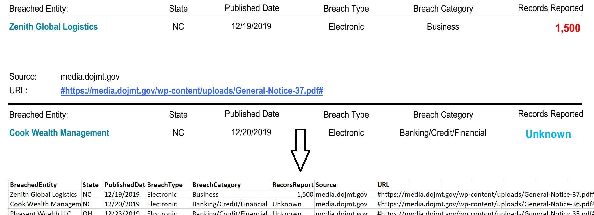

# Data extraction from a pdf file

A script to extract text data from a pdf file, converts it to pandas data frame and saves it in to a csv file.

## Requirements

Script works Python 3.7 or higher version.

Below libraries should be installed:

```
pip install pdfplumber
pip install pandas
```

## Visualization of extracted text from pdf file

Below image represents the format of pdf file and the extracted data in the CSV file.


